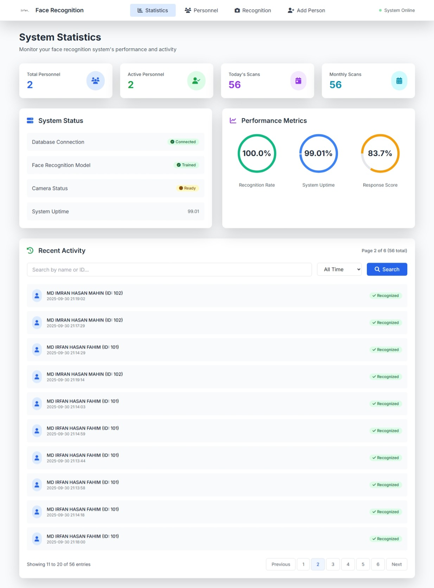
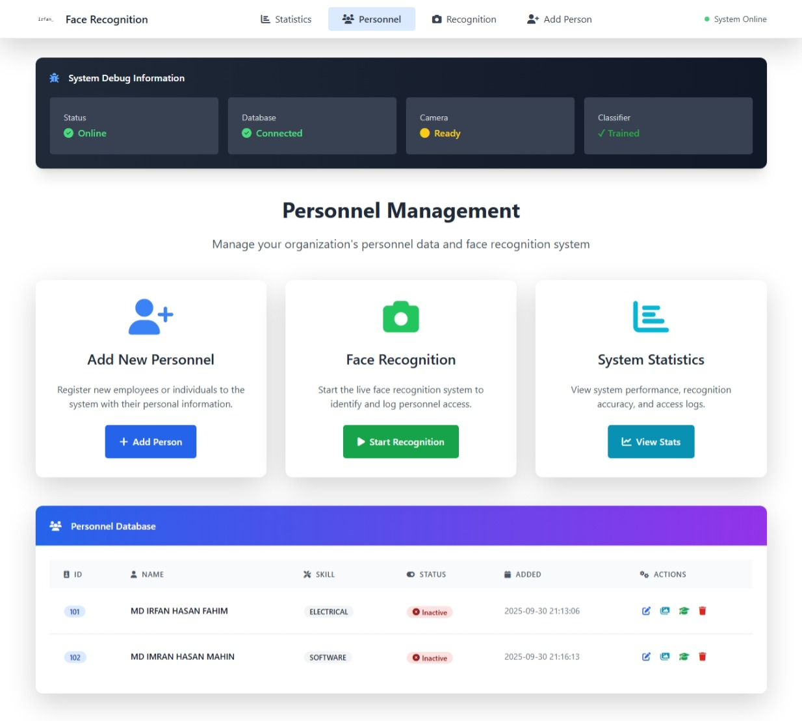
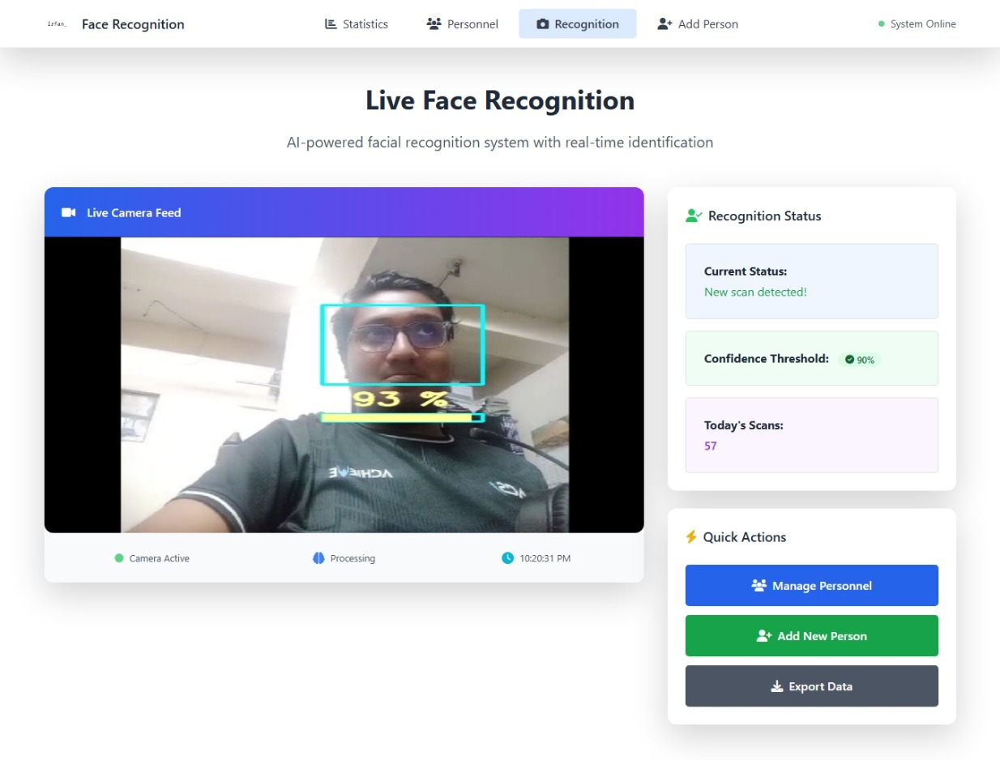
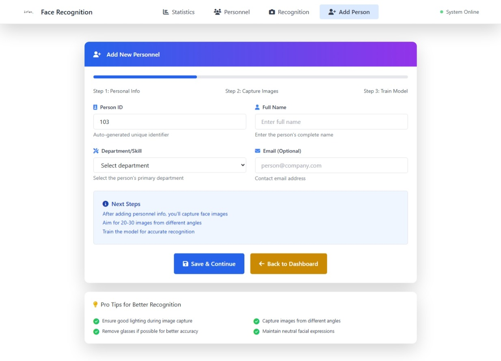

# Flask-OpenCV-Face-Recognition

1. Setup MongoDB:
   - Install MongoDB on your system if not already installed.
   - Start the MongoDB service.
   - Create a new database named `flask_db` using the MongoDB shell or a GUI tool like MongoDB Compass.

2. Database Structure:
   The application uses the following collections in the `flask_db` database:
   - `prs_mstr`: Stores master personnel data.
   - `img_dataset`: Stores dataset image information.
   - `accs_hist`: Stores access history (personnel entering restricted areas).

3. Application Overview:
   This is a room access control application where individuals must undergo facial scanning before entering restricted areas. The system records personnel data in the database upon entry.


4. Create Project and Install Packages:
    - Create a new project in your preferred IDE (e.g., PyCharm, VSCode).
    - Name the project `FlaskOpenCV_FaceRecognition`.
    - **Create and activate a virtual environment (venv):**
     
       On Windows:
       ```
       python -m venv venv
       venv\Scripts\activate
       ```
       On macOS/Linux:
       ```
       python3 -m venv venv
       source venv/bin/activate
       ```
    - Install the required packages using pip:
       ```
       pip install -r requirements.txt
       ```

5. Project Setup:
   - Clone this repository or download the source code.
   - Extract the contents into your project's root folder.

6. Configuration:
   - Update the MongoDB connection string in `app.py` if your MongoDB setup differs from the default (localhost:27017).
   - Ensure that the paths to resources (like haarcascade files) are correct for your system.

7. Running the Application:
   - Run `app.py` to start the Flask server.
   - Access the application through your web browser at `http://localhost:5000`.

Note: Make sure to handle sensitive data securely and follow best practices for production deployments.

## Demo

Here's a video demonstration of the Flask-OpenCV-Face-Recognition application:

[Demo Video](https://youtu.be/SSPUkJklMYc?si=eUjet70mOBb4W-L8)

### Screenshots










